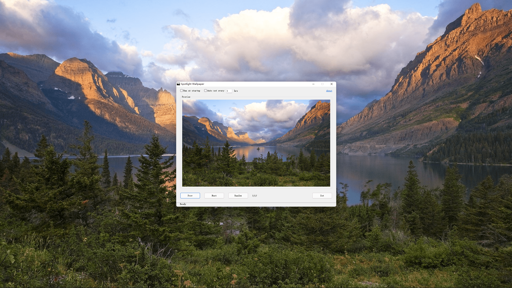

# Spotlight Wallpaper 

> Use spotlight lock screen images as wallpaper.

## Screenshot

## Features

* Autodetect original lock screen image changes
* Group images by resolution(landscape/portrait)
* Support auto set wallpaper by user settings
* Easy to use

## Download

You can get the latest version [here](https://github.com/chunqiuyiyu/spotlight-wallpaper/latest).

## License

[MIT](LICENSE) License.
